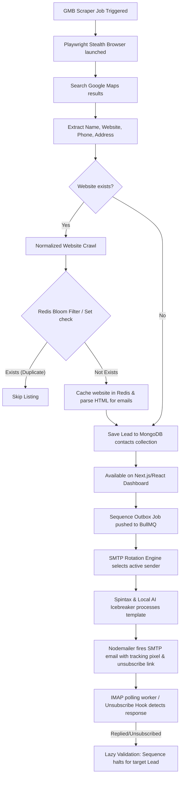

# 🚀 MERN + Bun Email Outreach & Distributed OSINT Scraping SaaS Platform

Welcome to the production-grade, enterprise-scale Lead Generation and Email Outreach Automation SaaS. This system integrates a high-performance **MERN Stack + Bun runtime backend** (Express, BullMQ, Redis, Mongoose) with a stealthy **Playwright OSINT scraping engine** and a **multi-tenant monetization pipeline (Stripe/Razorpay)**.

Designed to scrape, enrich, segment, and run personalized warm email sequences using LLM-generated icebreakers and smart SMTP rotation—completely on autopilot.

---

## 🏗️ System Architecture & Data Flow

Below is the end-to-end data flow showing how leads are extracted via stealth browser automation, cached and deduplicated using Redis, queued for sequential cold outreach, tracked for replies/opt-outs, and scaled under a multi-tenant subscription.



---

## 🗺️ System Roadmap (Phases 1 to 5)

This repository is built following a structured 5-phase core engineering roadmap:

### 🌟 Phase 1: Core Base Setup (Monolith Implementation)
*   **Step 1: Environment Setup**: Configured with the **Bun** runtime for high-speed JS/TS execution. Express server runs using `bun server.js`.
*   **Step 2: Database Layer Configuration**: MongoDB Atlas integration with schemas for **Sender** (accounts), **Campaign** (sequences), and **Lead** (contacts).
*   **Step 3: Single-Email Fire & Tracking Pipeline**: Mail delivery via Nodemailer. Features an invisible tracking pixel (``) masked as a standard logo asset to track real-time open rates.

### ⚙️ Phase 2: Core Engineering & Queue Infrastructure
*   **Step 4: Task Queue Setup (BullMQ + Redis)**: Outbound emails and heavy scraping jobs are offloaded to Redis-backed BullMQ queues as isolated, parallelizable jobs.
*   **Step 5: Smart SMTP Account Rotation Engine**: Multi-account rotation prioritizing accounts with the lowest daily usage (`emailsSentToday < dailyLimit`), sorted by the oldest `lastUsed` timestamp, with randomized jitter delay to preserve sender health score.
*   **Step 6: Smart Spintax Parser**: A recursive regex parser to resolve nested template variants (e.g., `{[Hi|Hello] {there|friend}}`) at send-time.

### 🔍 Phase 3: Advanced Lead Scraping & Verification
*   **Step 7: Playwright Headless Stealth Scraper**: Browser automation matching real-world WebGL fingerprints and headers to scrape directories. Scrapes website HTML and follows contact page links to harvest emails.
*   **Step 8: Email Verification (Bounce Protection)**: Real-time DNS MX lookup validation (`dns.resolveMx`) and socket-level SMTP handshake check to filter dead/fake addresses before they go to queue.
*   **Step 9: Free Local AI Icebreaker Integration**: Integration with a local **Ollama** server running **Llama 3 (8B)** to feed scraped website context and generate personalized outreach lines for zero-cost AI customization.

### 📈 Phase 4: Follow-up Automation, UX & Security
*   **Step 10: Multi-Step Sequences (Follow-up Engine)**: Automated follow-up pipeline. Delayed jobs schedule subsequent steps. Uses "Lazy Validation" to verify lead status (`Cold`/`Opened`) at run-time, automatically skipping execution if the lead replied or unsubscribed.
*   **Step 11: Real-Time Webhooks & Security Masking**: Server-Sent Events (SSE) / WebSockets stream scraper console logs and progress live to the UI. Tracking routes are masked to prevent spam filter flags.
*   **Step 12: Advanced Lead Segmentation & Security Enclave**: Automatic status tags (e.g. `Hot Lead` if 3+ opens, `Warm Lead` if 1 open). Symmetric database encryption (Node `crypto`) protects critical SMTP/App passwords.

### 💰 Phase 5: Warmup Network & SaaS Monetization
*   **Step 13: Unsubscribe Link & Legal Opt-Out**: Automatic unsubscribe handling via a dynamic footer link. Clicking the link flags the lead as `Unsubscribed`, stopping active follow-up sequences.
*   **Step 14: Automated Warmup Mode (Sender Safety)**: Auto-ramping warmup logic that increments a new mailbox's daily limits incrementally over time (e.g., Day 1: 5 emails, Day 2: 10 emails, Day 3: 20 emails).
*   **Step 15: Multi-Tenant Architecture & Agency Dashboard**: Fully isolated workspace accounts linking Users to Organizations, allowing multi-tenant workspace separation.
*   **Step 16: Subscription Gateway Integration**: Integration of Stripe/Razorpay Webhooks to automatically toggle user tiers (e.g., *Starter* to *Badshah*) and lift scraper limits.

---

## ⚡ Setup & Execution Guide

### Prerequisites
- **Bun** (v1.0+) installed on host machine
- **Docker & Docker Compose**
- **Ollama** (optional, for local AI processing)

### 1. Start the Docker Services
Start MongoDB, Redis, and Mongo Express (as message broker and data store) in the background:
```bash
docker start my-mongodb my-redis my-mongo-express
```
*(If you are setting up the proxy tool as well, run `docker compose up -d` in the `temp_proxy_tool` directory).*

### 2. Configure Environment Variables
Create a `.env` file in the `backend/` folder:
```env
PORT=5001
MONGODB_URI=mongodb://localhost:27017/email-outreach
REDIS_URL=redis://localhost:6379/0
JWT_SECRET=your_jwt_secret_token
ENCRYPTION_KEY=a1b2c3d4e5f6g7h8i9j0k1l2m3n4o5p6 # 32-character key for credentials encryption
KRAPTER_PROXY_URL=http://localhost:2223          # API port for KrapterProxyTool
KRAPTER_PROXY_KEY=sk_live_krapter_key_12345      # API Key for proxy retrieval
STRIPE_SECRET_KEY=sk_test_...                    # For billing and subscription
OLLAMA_HOST=http://localhost:11434               # Local LLM endpoint
```

### 3. Run Backend Services (with Bun)
```bash
cd backend
bun install
bun server.js
```
*Note: The Express server will automatically spawn the Celery background queue worker process. You do not need to start it in a separate terminal.*

### 4. Run Frontend Dashboard
```bash
cd frontend
npm install
npm start
```
Go to [http://localhost:3000](http://localhost:3000) to view the Outreach portal dashboard.

### 5. Local LLM Setup (Optional)
Install Ollama, pull the Llama 3 model, and start the local model service:
```bash
ollama pull llama3
ollama serve
```

---

## 🛠️ Advanced Algorithms Quick Look

### SMTP Rotation Algorithm
```typescript
// Core database selection query
const sender = await Sender.findOneAndUpdate(
  {
    status: 'active',
    emailsSentToday: { $lt: dailyLimit },
    // If a new day has started, emailsSentToday is automatically reset to 0 in our controller
  },
  {
    $inc: { emailsSentToday: 1 },
    $set: { lastUsed: new Date() }
  },
  { sort: { lastUsed: 1 }, new: true }
);
```

### Spintax Parser Algorithm
```typescript
function parseSpintax(text: string): string {
  const spintaxRegex = /\{[^{}]+\}/g;
  let parsed = text;
  while (spintaxRegex.test(parsed)) {
    parsed = parsed.replace(spintaxRegex, (match) => {
      const choices = match.slice(1, -1).split('|');
      return choices[Math.floor(Math.random() * choices.length)];
    });
  }
  return parsed;
}
```

---

## 🎓 Technical Interview Q&A ("How does the System Work?")

#### Q1: "How does the system prevent getting blocked during large-scale scraping?"
> *“We use Playwright Chromium loaded with the `playwright-extra` stealth module, which alters browser navigator headers (disabling `navigator.webdriver`), mimics WebGL graphics cards, and randomizes user-agents. Additionally, we integrate human-like sleep patterns (jitter) and route outbound scraping requests through our custom `KrapterProxyTool` rotating proxy API.”*

#### Q2: "How is the outbound campaign sequence protected from emailing warm leads who replied?"
> *“We implement a MERN + BullMQ delayed queue structure. When a campaign email is fired, the next sequence step is pushed into Redis as a delayed job. When that job is popped for execution, we perform a 'Lazy Validation' check. We query MongoDB first: if the lead's status has updated to 'Replied' or 'Unsubscribed', the job is instantly discarded. This avoids expensive task cancellation operations inside Redis.”*

#### Q3: "How do you protect sensitive data like users' SMTP credentials and app passwords?"
> *“We use AES-256-GCM symmetric encryption (via the native Node `crypto` library). Before saving SMTP settings to MongoDB, passwords are encrypted with a server-level secret key. The raw string is never exposed to the database, protecting details from database dumps.”*

#### Q4: "Why did you use Bun and Redis sets/bloom filters in this architecture?"
> *“Bun provides high-performance TypeScript execution out of the box with faster HTTP performance than standard Node.js. We use Redis sets as a high-speed de-duplication layer: before crawling any website or saving a lead, we check it against Redis in sub-milliseconds. This keeps the database light and prevents duplicate emails from being sent to the same client.”*