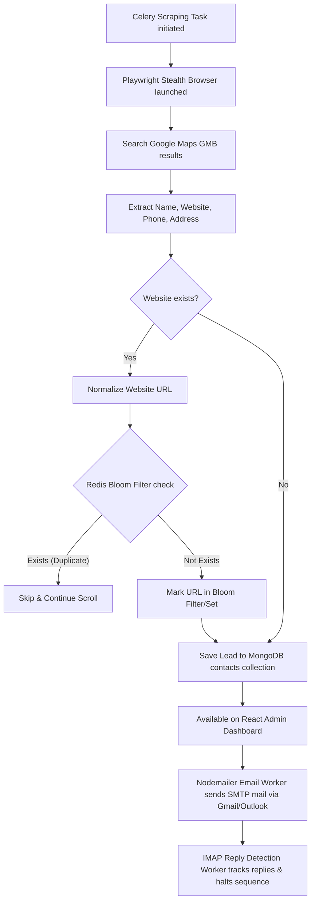

# 🚀 MERN Email Outreach & Distributed OSINT Scraping Platform

This repository is a production-grade, enterprise-scale Lead Generation and Email Outreach automation system. It bridges a high-performance **MERN Stack (MongoDB, Express, React, Node.js)** outbound marketing backend with an **asynchronous Python Celery & Playwright Stealth scraping engine**.

Designed to scrape, enrich, deduplicate, and run warm email outreach to thousands of companies at **zero cost** without getting blocked.

---

## 🏗️ System Architecture & Data Flow

Below is the architectural representation of how data is fetched from Google Maps (GMB), processed through the anti-duplication pipeline, saved to MongoDB, and automatically targeted for warm outreach.



---

## 🛠️ Core Technology Stack

### 1. Web App Backend & Frontend (Warm Outreach & Admin UI)
* **React 18 + Tailwind CSS**: A premium, clean dashboard for managing mailboxes, tracking open/click rates, uploading CSVs, and configuring automated multi-step sequences.
* **Node.js + Express**: Core REST API handling authentication, campaign orchestrations, DNS configurations, and rate-limiting.
* **MongoDB (Mongoose)**: Document database storing campaigns, users, templates, mailboxes, and scraped contacts.
* **Nodemailer + IMAP-Simple**: Handles warm email sending (via custom SMTP/Gmail App Passwords) and asynchronously polls mailboxes to detect replies and dynamically stop outreach sequences.

### 2. Scraping & Automation Engine (Background Workers)
* **Celery (Python)**: Event-driven distributed task manager. Runs background scraping jobs concurrently.
* **Redis**: Used as both the Celery message broker and the high-speed deduplication layer.
* **Playwright + Playwright-Stealth**: Headless browser automation mimicking natural human interactions (random delays, scrolling, customized viewport sizes, and user-agent rotations) to bypass modern bot-detection engines.
* **Redis Bloom Filter (or Set Fallback)**: Checks millions of websites in sub-milliseconds to avoid scraping or emailing the same company twice.

---

## 🛡️ Anti-Blocking & Human Simulation Strategies

To extract data scale (10,000+ records) continuously without IP blocks or CAPTCHA challenges, the engine implements these strategies:

1. **User-Agent Rotation**: Every browser context rotates clean, real-world user-agent strings representing Chrome, Firefox, and Safari on various desktop platforms.
2. **Playwright-Stealth**: Modifies javascript bindings, WebGL fingerprints, canvas APIs, and navigator values (`navigator.webdriver = false`) to hide browser automation signatures.
3. **Randomized Throttling (Human Typing & Scrolling)**: Inserts natural human delays (`random.uniform(2.0, 4.5)` seconds) between search clicks, scrolls, and interactions, avoiding predictable bot signatures.
4. **Natural Mouse and Scroll Simulations**: Emulates soft mouse clicks and uses relative scrolling rather than instantaneous page jumps.

---

## 🗂️ Project Directory Layout

```bash
my-leadgen-app/
├── backend/                  # Node.js Core Backend
│   ├── app/
│   │   └── workers/          # Python Background Workers
│   │       ├── celery_app.py # Celery initialization
│   │       └── automation/
│   │           └── scraper.py# GMB Playwright Stealth Scraper
│   ├── models/               # Mongoose DB Schemas
│   ├── routes/               # Express API Endpoints
│   ├── workers/              # Node Workers (Email sending & IMAP reply detection)
│   ├── test_scraper.py       # Standalone Scraper Tester
│   └── requirements.txt      # Python Scraper dependencies
├── frontend/                 # React UI Dashboard (Tailwind CSS)
└── README.md                 # System Architecture & Documentation
```

---

## ⚡ How to Setup & Run

### Prerequisites
- Node.js (v18+)
- Python (3.10+)
- Docker & Docker Compose

### 1. Spin up MongoDB, Redis, and Mongo Express Containers
Make sure your Docker Desktop/Daemon is running, and start the containers in your WSL terminal:
```bash
docker start my-mongodb my-redis my-mongo-express
```
* **Database Management Portal (Mongo Express)**: Open [http://localhost:8081](http://localhost:8081) in your browser.
  * **Username**: `admin`
  * **Password**: `pass`
  * *Note: A direct shortcut link to this dashboard has been integrated inside the sidebar navigation of your frontend application.*

### 2. Configure Node.js Backend & Run
```bash
cd backend
npm install
npm run dev
```
* **Note**: Nodemon server ko run karte hi **Celery background worker process automatically spawn (start) ho jayega**. Aapko alag terminal me Celery command run karne ki zaroori nahi hai! Sab kuch backend startup par backend itself execute aur manage karega.

### 3. Frontend Dashboard Chalaein
Ek naya terminal khol kar `frontend` folder me jayein aur interface start karein:
```bash
cd frontend
npm install
npm start
```
* **Kyun?**: Isse aapka portal [http://localhost:3000](http://localhost:3000) par run hoga jahan aap campaigns check kar sakte hain.

### 4. Run the Scraper Test Script (Optional standalone check)
To verify that Playwright is fetching and storing leads into MongoDB:
```bash
cd backend
PYTHONPATH=. ../scraper/venv/bin/python test_scraper.py
```

---

## 🎓 Interview Cheat Sheet: "How does the System Work?"

If an interviewer asks how you built this, here is your playbook:

#### Q1: "How did you scale the lead generation without third-party API costs?"
> *"I built a distributed scraping engine using Python, Playwright, and Celery. Instead of using expensive lead databases or scrapers, I automated headless browsers to query public business directories (like Google Maps), extract details, and save them directly to our database."*

#### Q2: "How did you prevent scraping and emailing the same lead twice?"
> *"I implemented a high-performance Redis cache layer. Whenever a company's website is found, it's checked against a Redis Bloom Filter (or a Redis Set). The check completes in sub-milliseconds, allowing the scraper to immediately skip duplicates without querying our primary MongoDB database, saving significant I/O."*

#### Q3: "How did you bypass anti-bot mechanisms like IP blocks or CAPTCHAs?"
> *"We simulate natural human behavior. We use `playwright-stealth` to strip out automated headers (`navigator.webdriver`), rotate real desktop User-Agents, and simulate human interactions by applying randomized sleep intervals (auto-throttling) and realistic scrolls. If scraping at an extreme scale, we route requests through a rotating proxy middleware."*

#### Q4: "How does the email outreach automation flow work?"
> *"Once contacts are added to MongoDB (either from the scraper or CSV upload), Express triggers an email outreach sequence. An asynchronous worker runs every 5 minutes using Node-Cron, sending personalized warm emails using SMTP. Simultaneously, an IMAP worker monitors the mailbox inbox; if a contact replies, their status immediately changes to 'replied', automatically pausing their email sequence."*

---

## 🏁 Step-by-Step Project Explanation & Execution Guide (Hindi & English)

### 📌 Project Kya Hai? (What is this project?)
Yeh project ek **Automated Lead Generation and Outreach Platform** hai. Iske do main parts hain:
1. **Node.js/React App (Outreach & Dashboard)**: Jahan aap campaigns create karte ho, mailboxes attach karte ho (Gmail/Outlook), dashboard me status dekhte ho, aur emails automatic schedule hote hain.
2. **Python/Playwright Scraper & Celery (Lead Finder)**: Jo Google Maps par search karke automatically company ke details (Name, Website, Phone, Rating) nikalta hai aur unhe direct database (MongoDB) me save kar deta hai bina block hue. Redis duplicates check karta hai taaki same client ko do baar mail na jaye.

---

### 🚀 Step-by-Step Project Run Kaise Karein? (Execution Steps)

#### **Step 1: Docker Containers Start Karein**
Sabse pehle check karein ki Docker Desktop chal raha hai, fir WSL terminal khol kar MongoDB, Redis aur Mongo Express start karein:
```bash
docker start my-mongodb my-redis my-mongo-express
```

#### **Step 2: Node.js Backend Server Chalaein**
Terminal me `backend` folder me jayein aur application server start karein:
```bash
cd backend
npm run dev
```
* **Kyun?**: Isse Express API start ho jayegi port `5001` par jo client requests handle karegi, aur background me Nodemailer/IMAP workers start honge. Aur **Celery worker auto-spawn command background process me automatically start ho jayegi**.

#### **Step 3: Frontend Dashboard Chalaein**
Ek naya terminal khol kar `frontend` folder me jayein aur interface start karein:
```bash
cd frontend
npm start
```
* **Kyun?**: Isse aapka outreach portal [http://localhost:3000](http://localhost:3000) par run hoga.

#### **Step 4: Scraper Live Status & Database UI Management**
- **Live Scraping Status**: Jab aap `Contacts` menu me jakar **Launch Scraper** trigger karenge, to modal window ke under ek beautiful progress bar, logs message aur live scraped leads list preview real-time popup ho jayegi!
- **Database Manage (PhpMyAdmin style)**: [http://localhost:8081](http://localhost:8081) open karein. **Username: admin** aur **Password: pass** enter karke MongoDB collections (contacts, campaigns, users) ko direct manage aur view karein.

---

## 📖 Complete UI & Backend Operations Guide (New User Guide)

Agar aap is project par naye hain, to yaha step-by-step bataya gaya hai ki dashboard ke kis menu me kya kaam hota hai aur system ko end-to-end kaise run karna hai.

### 📌 UI Ke Saare Menus Aur Unka Kaam (Menu Explanations)

1. **Dashboard (Main Home)**:
   - **Kaam**: Pure system ka high-level overview. Yaha aapko total emails sent, reply rate, bounce rate aur click rates ke stats graphs ke sath dikhte hain.
2. **Mailboxes (Email Account Connections)**:
   - **Kaam**: Yaha aap wo email addresses add karte ho jahan se emails send karne hain (e.g. your professional Gmail or Outlook accounts).
   - **Kaise use karein?**: "Add Mailbox" click karein. SMTP details (Host: `smtp.gmail.com`, Port: `587`) aur password ki jagah **Gmail App Password** enter karein (Original account password enter nahi karna). Add karne ke baad "Verify" button par click karein. Status `Verified` hona zaroori hai.
3. **Contacts (Lead Management & Scraper)**:
   - **Kaam**: Yeh leads ka database repository hai. Yaha aap manually contacts add kar sakte hain, CSV file upload kar sakte hain, ya direct scraper trigger kar sakte hain.
   - **Scraper Engine**: Is page par "Launch Scraper" button hai. Waha query likhein (e.g. `Web Development Noida`) aur limit set karein. Celery worker ise run karega aur contacts database me load ho jayenge.
4. **Templates (Outreach Message Drafts)**:
   - **Kaam**: Warm email templates manage karne ke liye.
   - **Placeholders**: Template likhte waqt `{{firstName}}`, `{{company}}` templates use karein. Send hote waqt system automatically lead ke real details replace kar dega (e.g., `Hello {{firstName}}` turns into `Hello Sahil`).
5. **Campaigns (Email Sequences)**:
   - **Kaam**: Pure outreach execution ka module.
   - **Outreach Sequence**: Campaign create karein, targets list (contacts) select karein, send karne ke liye mailbox select karein, aur sequence (Step 1, Step 2 after 24 hours, etc.) template attach karein. Campaign ko "Start" click karte hi email flow chalu ho jata hai.
6. **Replies (Response Detection)**:
   - **Kaam**: IMAP Reply Detection worker inbox scan karta hai. Agar kisi lead ne reply kiya, to unka response replies portal me load hota hai aur unhe campaign sequence se auto-remove kar diya jata hai taaki unhe follow-ups na jayein.
7. **Email History (Audit Logs)**:
   - **Kaam**: Har ek sent mail ki details time aur status (Sent/Failed/Opened) ke sath check karne ke liye.
8. **Analytics (Detailed reports)**:
   - **Kaam**: Campaign-wise filter lagakar sent metrics ki report dekhna.
9. **DNS Settings (Authentication)**:
   - **Kaam**: Professional email deliverability ke liye. Jab aap koi domain attach karte hain, to ye SPF, DKIM, aur DMARC records generate karta hai jise aapko apne domain manager (e.g. GoDaddy) me CNAME/TXT records me add kama hota hai. isse emails spam folder me nahi jaate.
10. **Settings (User Profile)**:
    - **Kaam**: User password changes aur profile info updates ke liye.

---

### 🚀 End-to-End User Flow (Kadam-by-Kadam Guide)

1. **Step 1: Sign up & Login**: First time running par register page par jakar naya user account banayein aur dashboard me login karein.
2. **Step 2: Connect Mailbox**: `Mailboxes` menu me jayein, "Add Mailbox" par click karein, and details verify karein.
3. **Step 3: Collect Leads**: `Contacts` menu me jayein, "Launch Scraper" click karein, search query daalein, aur Celery background scraping chalayein.
4. **Step 4: Create Template**: `Templates` menu me outreach template (with variables like `{{firstName}}`) banayein.
5. **Step 5: Launch Campaign**: `Campaigns` menu me jayein, "Create Campaign" click karein, sequence schedule karein aur use active karein.
6. **Step 6: Track & Manage Replies**: Background cron worker har 5 min me campaign chalaega, log verification `Email History` me dekhein, aur responses `Replies` menu me control karein.
7. **Step 7: Database Management**: Dashboard ke **Database (Mongo)** side link par click karein. Username: `admin` aur Password: `pass` enter karke local data collections manage karein.