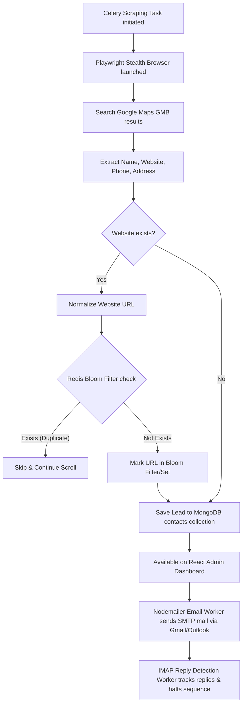

# 🚀 MERN Email Outreach & Distributed OSINT Scraping Platform

This repository is a production-grade, enterprise-scale Lead Generation and Email Outreach automation system. It bridges a high-performance **MERN Stack (MongoDB, Express, React, Node.js)** outbound marketing backend with an **asynchronous Python Celery & Playwright Stealth scraping engine**.

Designed to scrape, enrich, deduplicate, and run warm email outreach to thousands of companies at **zero cost** without getting blocked.

---

## 🏗️ System Architecture & Data Flow

Below is the architectural representation of how data is fetched from Google Maps (GMB), processed through the anti-duplication pipeline, saved to MongoDB, and automatically targeted for warm outreach.



---

## 🛠️ Core Technology Stack

### 1. Web App Backend & Frontend (Warm Outreach & Admin UI)
* **React 18 + Tailwind CSS**: A premium, clean dashboard for managing mailboxes, tracking open/click rates, uploading CSVs, and configuring automated multi-step sequences.
* **Node.js + Express**: Core REST API handling authentication, campaign orchestrations, DNS configurations, and rate-limiting.
* **MongoDB (Mongoose)**: Document database storing campaigns, users, templates, mailboxes, and scraped contacts.
* **Nodemailer + IMAP-Simple**: Handles warm email sending (via custom SMTP/Gmail App Passwords) and asynchronously polls mailboxes to detect replies and dynamically stop outreach sequences.

### 2. Scraping & Automation Engine (Background Workers)
* **Celery (Python)**: Event-driven distributed task manager. Runs background scraping jobs concurrently.
* **Redis**: Used as both the Celery message broker and the high-speed deduplication layer.
* **Playwright + Playwright-Stealth**: Headless browser automation mimicking natural human interactions (random delays, scrolling, customized viewport sizes, and user-agent rotations) to bypass modern bot-detection engines.
* **Redis Bloom Filter (or Set Fallback)**: Checks millions of websites in sub-milliseconds to avoid scraping or emailing the same company twice.

---

## 🛡️ Anti-Blocking & Human Simulation Strategies

To extract data scale (10,000+ records) continuously without IP blocks or CAPTCHA challenges, the engine implements these strategies:

1. **User-Agent Rotation**: Every browser context rotates clean, real-world user-agent strings representing Chrome, Firefox, and Safari on various desktop platforms.
2. **Playwright-Stealth**: Modifies javascript bindings, WebGL fingerprints, canvas APIs, and navigator values (`navigator.webdriver = false`) to hide browser automation signatures.
3. **Randomized Throttling (Human Typing & Scrolling)**: Inserts natural human delays (`random.uniform(2.0, 4.5)` seconds) between search clicks, scrolls, and interactions, avoiding predictable bot signatures.
4. **Natural Mouse and Scroll Simulations**: Emulates soft mouse clicks and uses relative scrolling rather than instantaneous page jumps.

---

## 🗂️ Project Directory Layout

```bash
my-leadgen-app/
├── backend/                  # Node.js Core Backend
│   ├── app/
│   │   └── workers/          # Python Background Workers
│   │       ├── celery_app.py # Celery initialization
│   │       └── automation/
│   │           └── scraper.py# GMB Playwright Stealth Scraper
│   ├── models/               # Mongoose DB Schemas
│   ├── routes/               # Express API Endpoints
│   ├── workers/              # Node Workers (Email sending & IMAP reply detection)
│   ├── test_scraper.py       # Standalone Scraper Tester
│   └── requirements.txt      # Python Scraper dependencies
├── frontend/                 # React UI Dashboard (Tailwind CSS)
├── scraper/                  # Python Venv Directory
└── README.md                 # System Architecture & Documentation
```

---

## ⚡ How to Setup & Run

### Prerequisites
- Node.js (v18+)
- Python (3.10+)
- Docker & Docker Compose

### 1. Spin up MongoDB and Redis Containers
Make sure your Docker daemon is running, and start the services:
```bash
docker start my-mongodb my-redis
```

### 2. Configure Node.js Backend & Run
```bash
cd backend
npm install
npm run dev
```

### 3. Run the Scraper Test Script (Standalone verification)
To verify that Playwright is fetching and storing leads into MongoDB:
```bash
cd backend
PYTHONPATH=. ../scraper/venv/bin/python test_scraper.py
```

### 4. Run the Celery Worker
To start processing tasks asynchronously:
```bash
cd backend
PYTHONPATH=. ../scraper/venv/bin/celery -A app.workers.celery_app worker --loglevel=info
```

---

## 🎓 Interview Cheat Sheet: "How does the System Work?"

If an interviewer asks how you built this, here is your playbook:

#### Q1: "How did you scale the lead generation without third-party API costs?"
> *"I built a distributed scraping engine using Python, Playwright, and Celery. Instead of using expensive lead databases or scrapers, I automated headless browsers to query public business directories (like Google Maps), extract details, and save them directly to our database."*

#### Q2: "How did you prevent scraping and emailing the same lead twice?"
> *"I implemented a high-performance Redis cache layer. Whenever a company's website is found, it's checked against a Redis Bloom Filter (or a Redis Set). The check completes in sub-milliseconds, allowing the scraper to immediately skip duplicates without querying our primary MongoDB database, saving significant I/O."*

#### Q3: "How did you bypass anti-bot mechanisms like IP blocks or CAPTCHAs?"
> *"We simulate natural human behavior. We use `playwright-stealth` to strip out automated headers (`navigator.webdriver`), rotate real desktop User-Agents, and simulate human interactions by applying randomized sleep intervals (auto-throttling) and realistic scrolls. If scraping at an extreme scale, we route requests through a rotating proxy middleware."*

#### Q4: "How does the email outreach automation flow work?"
> *"Once contacts are added to MongoDB (either from the scraper or CSV upload), Express triggers an email outreach sequence. An asynchronous worker runs every 5 minutes using Node-Cron, sending personalized warm emails using SMTP. Simultaneously, an IMAP worker monitors the mailbox inbox; if a contact replies, their status immediately changes to 'replied', automatically pausing their email sequence."*

---

## 🏁 Step-by-Step Project Explanation & Execution Guide (Hindi & English)

### 📌 Project Kya Hai? (What is this project?)
Yeh project ek **Automated Lead Generation and Outreach Platform** hai. Iske do main parts hain:
1. **Node.js/React App (Outreach & Dashboard)**: Jahan aap campaigns create karte ho, mailboxes attach karte ho (Gmail/Outlook), dashboard me status dekhte ho, aur emails automatic schedule hote hain.
2. **Python/Playwright Scraper & Celery (Lead Finder)**: Jo Google Maps par search karke automatically company ke details (Name, Website, Phone, Rating) nikalta hai aur unhe direct database (MongoDB) me save kar deta hai bina block hue. Redis duplicates check karta hai taaki same client ko do baar mail na jaye.

---

### 🚀 Step-by-Step Project Run Kaise Karein? (Execution Steps)

#### **Step 1: Docker Containers Start Karein**
Sabse pehle check karein ki Docker Desktop chal raha hai, fir WSL terminal khol kar MongoDB aur Redis start karein:
```bash
docker start my-mongodb my-redis
```
* **Kyun?**: MongoDB aapki lead directory aur configuration store karega. Redis queues aur anti-duplicate caches manage karega.

---

#### **Step 2: Node.js Backend Server Chalaein**
Terminal me `backend` folder me jayein aur application server start karein:
```bash
cd backend
npm install
npm run dev
```
* **Kyun?**: Isse Express API start ho jayegi port `5001` par jo client requests handle karegi, aur background me Email/IMAP sending workers start honge.

---

#### **Step 3: Frontend Dashboard Chalaein**
Ek naya terminal khol kar `frontend` folder me jayein aur interface start karein:
```bash
cd frontend
npm install
npm start
```
* **Kyun?**: Isse aapka outreach portal `http://localhost:3000` par run hoga jahan aap live analytics, leads list aur mailbox settings dekh sakte hain.

---

#### **Step 4: Scraper Test Run (Direct Testing)**
Agar aapko testing karni hai ki scraper data nikal kar DB me daal raha hai ya nahi, to python script directly execute karein:
```bash
cd backend
PYTHONPATH=. ../scraper/venv/bin/python test_scraper.py
```
* **Kyun?**: Yeh script Google Maps search page open karke data scrape karegi, use Redis me duplicate check karegi, aur nayi companies ko MongoDB `contacts` table me insert karegi.

---

#### **Step 5: Distributed Background Workers Setup (Celery & Redis)**
Agar aap distributed scraping tasks background me queue ke through trigger karna chahte hain:
```bash
cd backend
PYTHONPATH=. ../scraper/venv/bin/celery -A app.workers.celery_app worker --loglevel=info
```
* **Kyun?**: Yeh celery worker background me running rahega. Jab bhi aap dashboard ya console se scraping trigger karenge, tasks automatically Redis pipeline ke through execute honge.